# 🚀 Gas Service App

A complete Flutter application for managing gas services, emergency reports, billing, and technician workflows.

The app supports two roles:
- 👤 Customer
- 🛠 Technician

---

## 📱 Screenshots

---

### 🚀 Onboarding
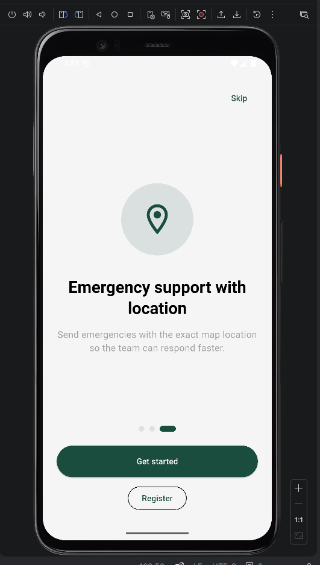

---

### 🔐 Authentication

#### Login
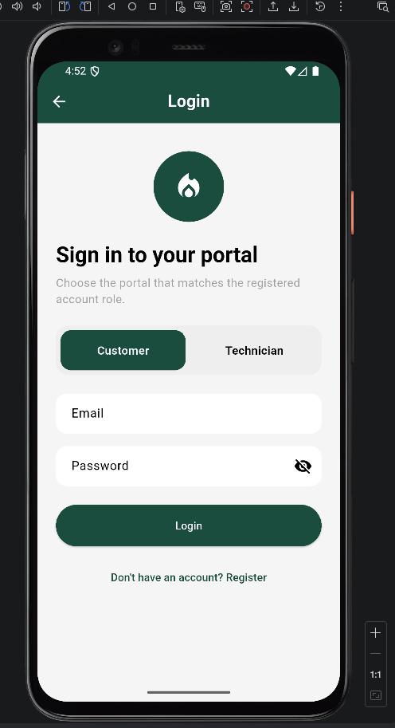

#### Register
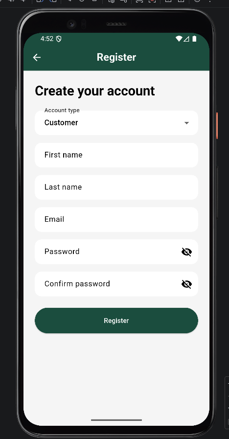

---

# 👤 Customer App

---

### 🏠 Home Dashboard
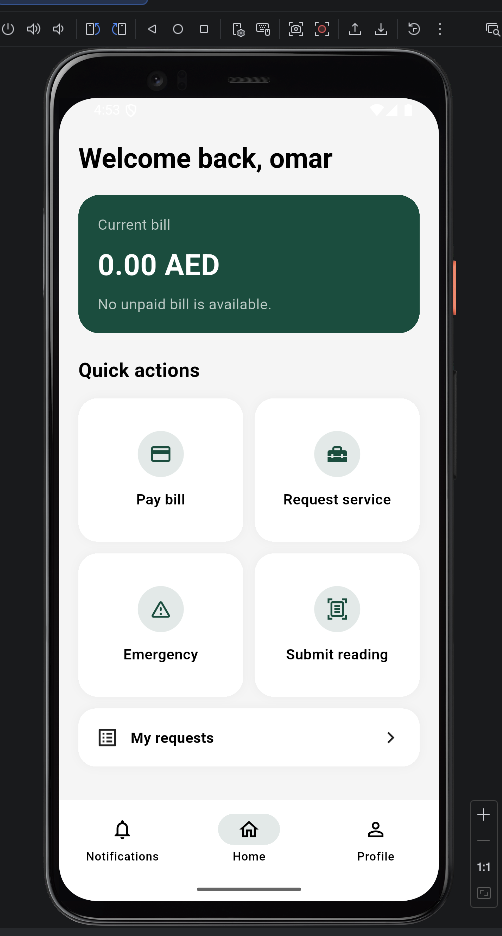

---

### 👤 Profile & Settings

#### Profile
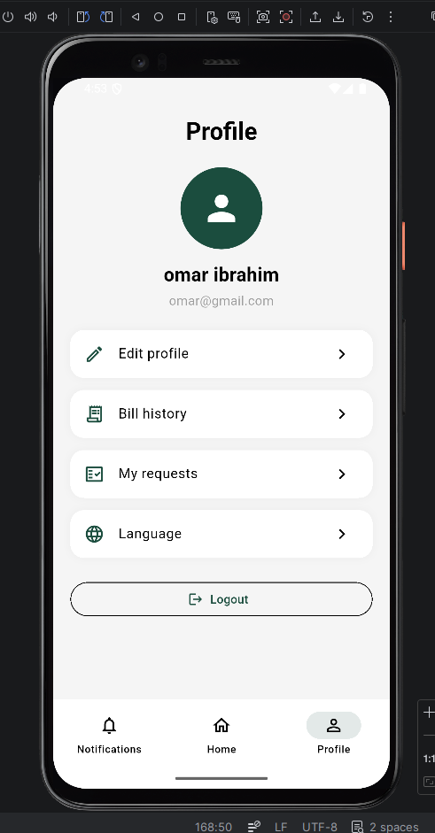

#### Notifications (UI only)
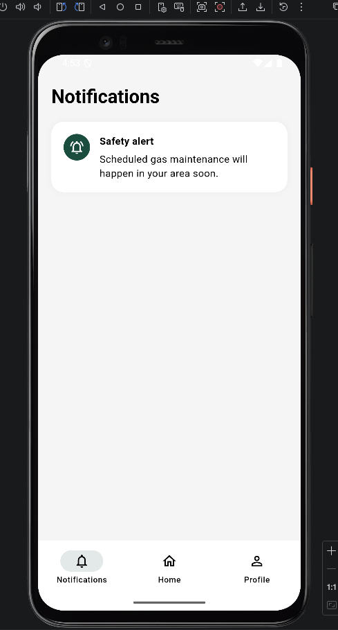

---

### 💡 Meter Reading
#### reads the numbers from the pics
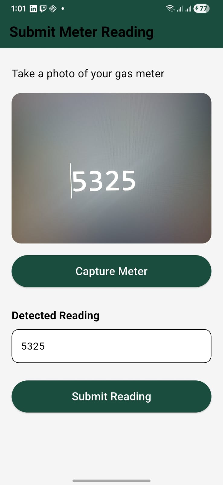

---

### 💳 Billing

#### Pay Bill
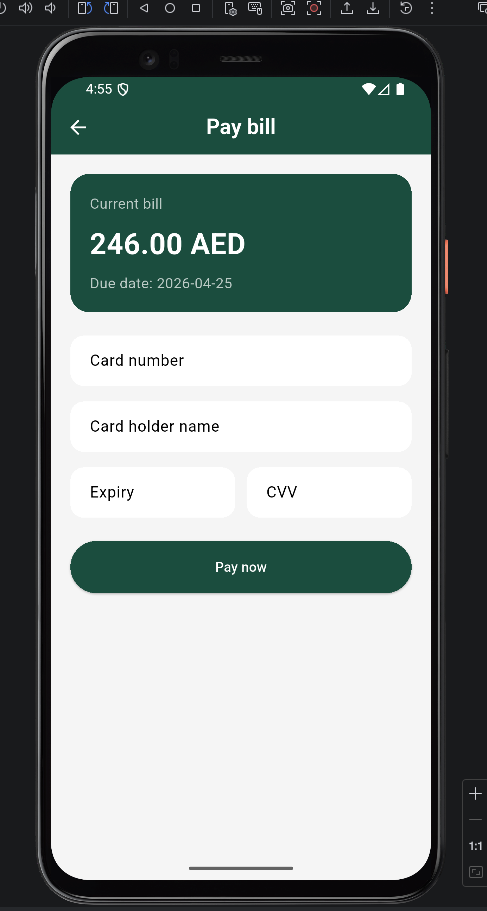

#### Bill History
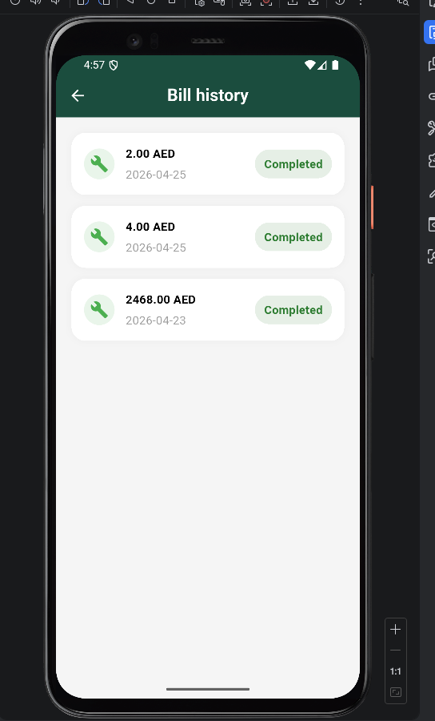

#### Payment Success
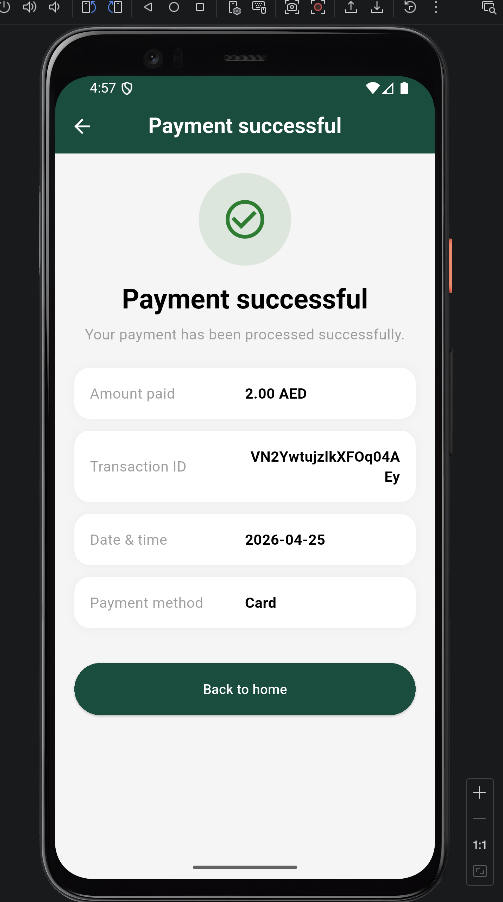

---

### 🛠 Service Requests

#### Request Service
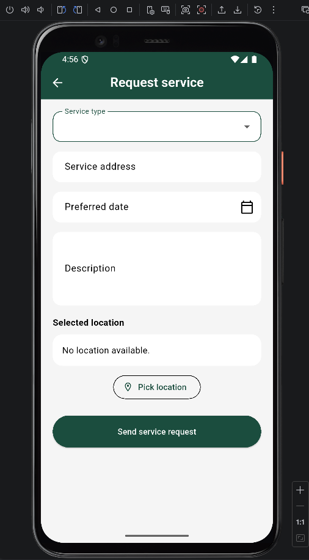

#### Pick Location (Google Maps)
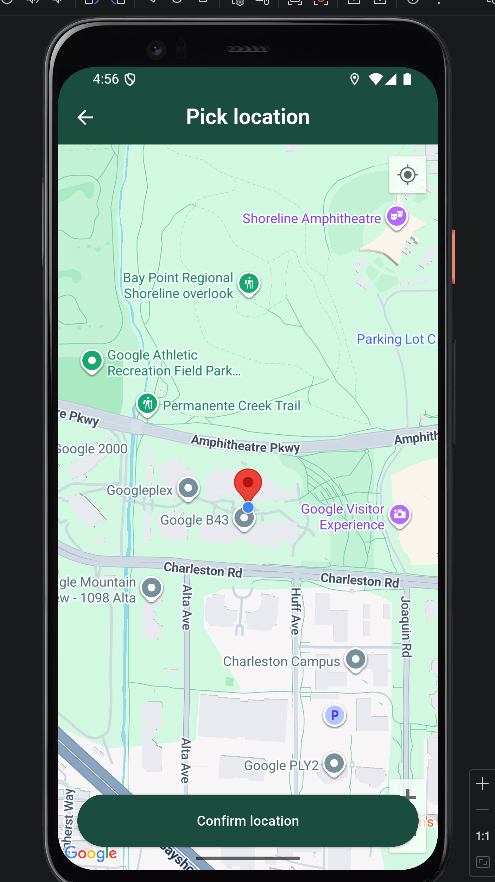

#### Service Status
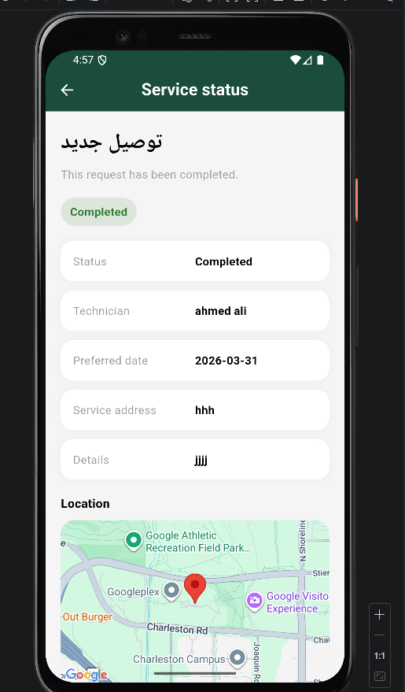

---

### 🚨 Emergency

#### Emergency Report
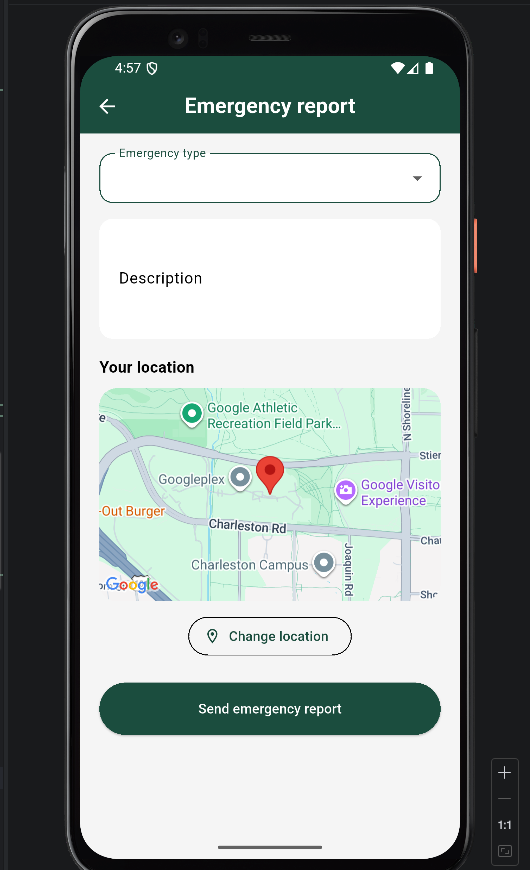

---

### 📋 Requests List
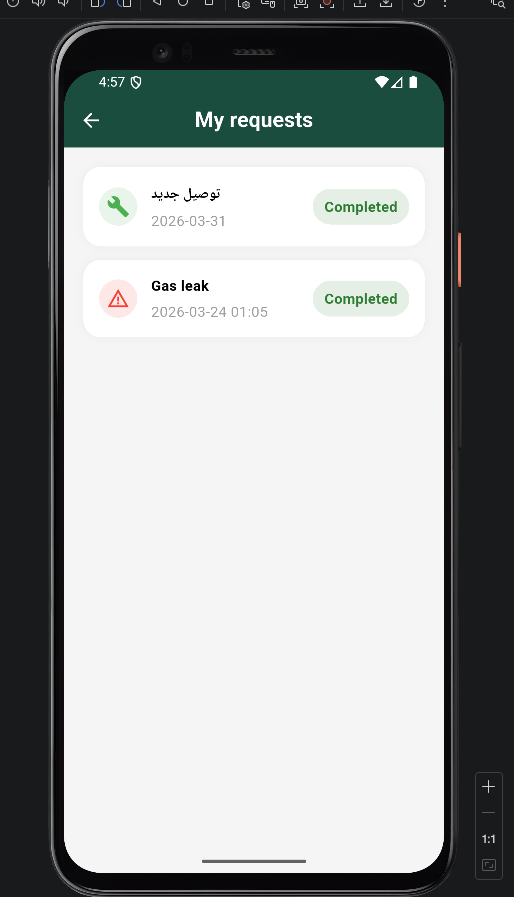

---

# 🛠 Technician App

---

### 🏠 Dashboard
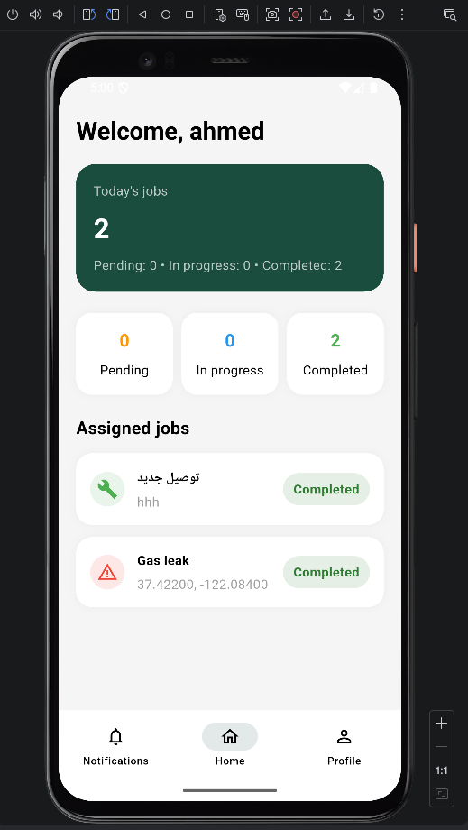

---

### 📄 Request Details (Pending)
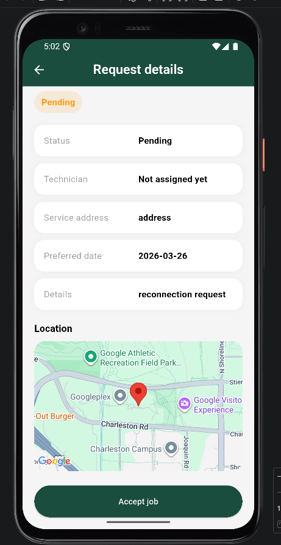

---

### 🔄 Request In Progress
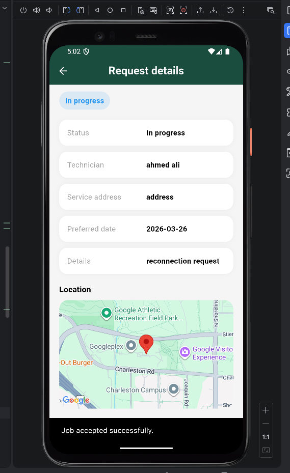

---

### ✅ Request Completed
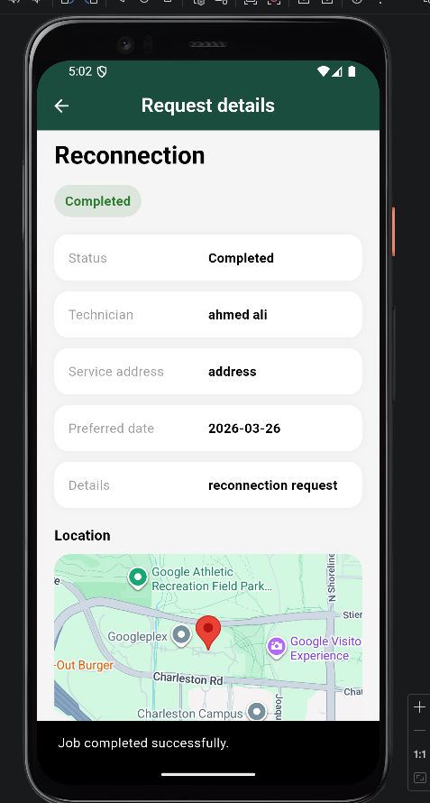

---

## ✨ Features

- 🔐 Authentication with role-based access (Customer / Technician)
- 🚫 Prevent login to wrong portal
- 🛠 Create service requests with map location
- 🚨 Emergency reporting with GPS location
- 📍 Google Maps integration (customer + technician)
- 📊 Submit gas meter readings
- 💳 Pay bills and view history
- 📋 Track requests with real-time updates
- 🧑‍🔧 Technician job management (Accept / Complete)
- 🌐 Full Arabic & English localization
- 💾 Persistent language (saved across app restarts)
- ⚡ Real-time updates using Firebase Firestore
- 🧠 State management using Cubit (Bloc)

---

## 🏗 Architecture
